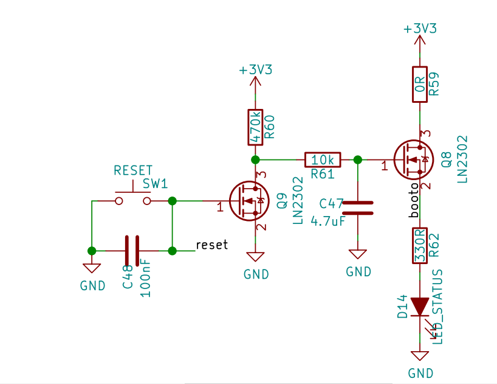

# ph_biological_safety_class1_cabinet_controller_hw
This is hardware controller for project PCR Cabinets.

# Description

## Features:
    * Điện áp ngõ vào 12VDC.
    * Hỗ trợ 6 ngõ vào Input giao tiếp với các thiết bị ngoại vi: cảm biến cửa, cảm biến nhiệt độ,...
    * Hỗ trợ 8 ngõ ra Output giao tiếp với các thiết bị ngoại vi: relay, các thiết bị điện dân dụng kết hợp Relay,...
    * Bộ định thời gian thực Real Time Clock (RTC) cho phép cập nhật thời gian hoạt động và ngày giờ trên hệ thống. 
    * Tích hợp cảm biến nhiệt độ DS18B20 xác định nhiệt độ của hệ thống trong khi hệ thống đang hoạt động.
    * Tích hợp bộ thu phát hồng ngoại IR thuận lợi khi điều khiển các chức năng trên hệ thống.
    * Tích hợp khối Input giao tiếp với bộ điều khiển ngoại vi keyboard.
    * Mở rộng bộ nhớ lưu trữ data flash lên đến 8Mbit với IC W25Q80BV.
    * Giao tiếp 485 với máy tính, các thiết bị ngoại vi.
    * Tích hợp bộ cảm biến chênh áp SM5852 cung cấp chức năng giám sát sự chênh lệch áp suất ngõ vào và ngõ ra của thiết bị.
    * Màn hình LCD hiển thị các trạng thái của các thiết bị ngoại vi, ngày giờ hệ thống và các cài đặt khi cần thiết.
# Hardware
## Schematics

[Download](./documents/schema_ph_biological_safety_class1_controller_hw.pdf)

- Chế độ bootloader với 1 nút nhấn tích hợp hai chức năng reset và boot hệ thống. Led báo hiệu khi vào chế độ boot (nhấn giữ nút button trong 4 chu kỳ máy).

## PCB Layout

## 3D

## Pinout

# Gerber

[Download](./gerber/gerber_ph_biological_safety_class1_controller_hw.zip)

[IR_Download](./gerber/gerber_ph_biological_safety_class1_ir_hw.zip)

# BOMLIST

[Download](./assets/ph_biological_safety_class1_controller_hw.csv)

# Documents

[Manual User](./documents/manual_ph_biological_safety_class1.pdf)

[Manucal Process of Manufacturing](./documents/manual_process_of_manufacturing_biological_safety_class1_board.pdf)

[Diagram Connect](./documents/diagram_connect_ph_biological_safety_class1_controller_hw.pdf)

# License

